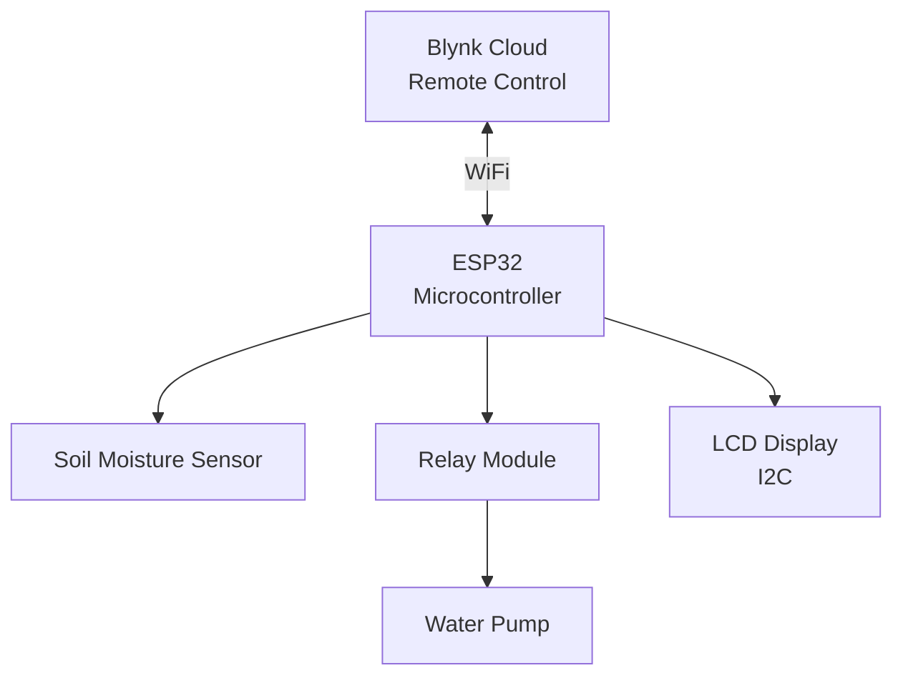
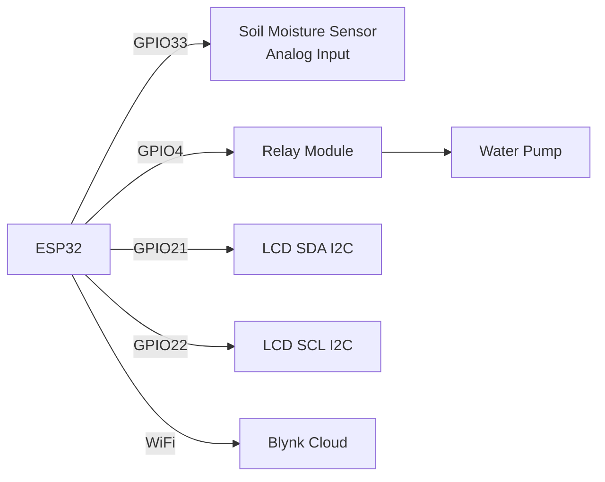

# Smart Plant Watering System

This project implements an automated plant watering system using an ESP32 microcontroller, soil moisture sensor, and water pump. The system can be monitored and controlled remotely through the Blynk mobile app.

## Features

- Real-time soil moisture monitoring
- Remote water pump control via Blynk app
- LCD display showing moisture levels and pump status
- WiFi connectivity for remote access
- Automatic moisture level mapping (0-100%)

## Hardware Components

- ESP32 development board
- Soil moisture sensor (analog)
- Relay module
- Water pump/motor
- LCD display (16x2 with I2C interface)
- Power supply
- Water container and tubing

## Pin Configuration

- Soil Moisture Sensor: GPIO33
- Relay Control: GPIO4
- LCD: I2C interface (SDA/SCL pins)

## Software Requirements

- Arduino IDE
- Required Libraries:
  - LiquidCrystal_I2C
  - Wire
  - WiFiClient
  - BlynkSimpleEsp32

## Setup Instructions

1. Install all required libraries in Arduino IDE
2. Configure your Blynk authentication token
3. Update WiFi credentials (SSID and password)
4. Connect hardware components according to pin configuration
5. Upload code to ESP32
6. Configure Blynk app:
   - Add gauge widget to V0 for moisture display
   - Add button widget to V1 for pump control

## Operation

- System displays "System Loading" message on startup
- LCD continuously shows current soil moisture percentage
- Motor status (ON/OFF) is displayed on LCD
- Blynk app shows real-time moisture levels
- Water pump can be controlled manually via Blynk app

## Notes

- Moisture values are mapped from 0-100%
- Default state: motor OFF (relay HIGH)
- Sensor readings are taken every 200ms
- LCD updates in real-time with moisture levels and pump status

## Troubleshooting

- Ensure proper WiFi connectivity
- Verify Blynk authentication token
- Check all physical connections
- Monitor Serial output (115200 baud) for debugging

## Diagram

## More

##### High-Level Component Diagram

##### ESP32 Pin Configuration

Data Flow:
1. Soil Moisture → ESP32 → Blynk App
2. Blynk App → ESP32 → Relay → Pump
3. ESP32 → LCD Display (Status)

## Contributing

This project is open source and welcomes contributions. To contribute, simply fork the repository and submit a pull request with your changes.

## License

This project is licensed under the MIT License. See the [LICENSE](LICENSE) file for details.